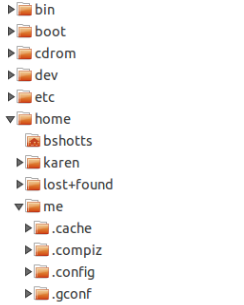

# 2 – Navigation

Nachdem du nun weißt, wie man Befehle eingibt, lernen wir als Nächstes, uns im Dateisystem von Linux zurechtzufinden.

In diesem Kapitel begegnen dir drei grundlegende Befehle:

- **`pwd`** – Zeigt das aktuelle Arbeitsverzeichnis an.
- **`cd`** – Wechselt das Verzeichnis.
- **`ls`** – Listet den Inhalt eines Verzeichnisses auf.

## Den Verzeichnisbaum verstehen

Wie Windows organisiert auch ein Unix-ähnliches Betriebssystem wie Linux seine Dateien in einer **hierarchischen Verzeichnisstruktur**. Das bedeutet, dass alle Dateien und Verzeichnisse baumartig angeordnet sind. Ein Verzeichnis (auf anderen Betriebssystemen oft auch **Ordner** genannt) kann sowohl Dateien als auch weitere Unterverzeichnisse enthalten.

Ganz oben steht das **Wurzelverzeichnis** (_root directory_). Es bildet den Ausgangspunkt des gesamten Dateisystems. Von dort verzweigt sich der Verzeichnisbaum in weitere Verzeichnisse und Unterverzeichnisse, die wiederum Dateien und weitere Unterverzeichnisse enthalten können.

::: note
**Hinweis:** Im Gegensatz zu Windows, das für jedes Laufwerk einen eigenen Verzeichnisbaum verwendet (z. B. `C:\` oder `D:\`), besitzt Linux immer **genau einen** Verzeichnisbaum – unabhängig davon, wie viele Festplatten, SSDs oder andere Speichermedien an den Computer angeschlossen sind.

Zusätzliche Speichergeräte werden an einer beliebigen Stelle in diesen Verzeichnisbaum **eingehängt** (_mounted_). Wo genau das geschieht, entscheidet der Systemadministrator – also die Person, die das System verwaltet. Also in Idealfall bald DU
:::

## Das aktuelle Arbeitsverzeichnis

Die meisten kennen wahrscheinlich einen grafischen Dateimanager, der das Dateisystem als Baumstruktur darstellt – so wie in Abbildung 1. Dabei befindet sich das Wurzelverzeichnis normalerweise ganz oben, während sich die einzelnen Verzeichnisse darunter wie Äste eines Baumes verzweigen. Auf der Kommandozeile gibt es allerdings keine grafische Darstellung. Deshalb müssen wir uns das Dateisystem etwas anders vorstellen.



Stell dir vor, das Dateisystem ist ein Labyrinth in Form eines auf den Kopf gestellten Baumes, und du stehst mitten darin. Zu jedem Zeitpunkt befindest du dich genau in einem Verzeichnis. Von dort aus kannst du die Dateien in diesem Verzeichnis sehen, den Weg zum Verzeichnis über dir – dem **übergeordneten Verzeichnis** (_parent directory_) – sowie alle Unterverzeichnisse unter dir. Das Verzeichnis, in dem du dich gerade befindest, nennt man **aktuelles Arbeitsverzeichnis** (_current working directory_ oder kurz: cwd). Um es anzuzeigen, verwendest du den Befehl `pwd` (_print working directory_).

```bash
[me@linuxbox ~]$ pwd
/home/me
```

Wenn du dich an deinem Linux-System anmeldest oder eine neue Terminalsitzung startest, ist das aktuelle Arbeitsverzeichnis standardmäßig dein **Home-Verzeichnis**. Jeder Benutzer besitzt sein eigenes Home-Verzeichnis. Für normale Benutzer ist es außerdem der wichtigste Ort, an dem sie Dateien erstellen und bearbeiten dürfen.

## Den Inhalt eines Verzeichnisses anzeigen

Um die Dateien und Verzeichnisse im aktuellen Arbeitsverzeichnis anzuzeigen, verwenden wir den Befehl `ls`.

```bash
[me@linuxbox ~]$ ls
Desktop  Documents  Music  Pictures  Public  Templates  Videos
```

Mit `ls` kannst du allerdings nicht nur den Inhalt des aktuellen Arbeitsverzeichnisses anzeigen. Der Befehl kann auch den Inhalt beliebiger anderer Verzeichnisse auflisten und bietet noch viele weitere nützliche Funktionen. Im nächsten Kapitel werden wir uns `ls` deshalb genauer ansehen.

## Das aktuelle Arbeitsverzeichnis wechseln

Um das aktuelle Arbeitsverzeichnis zu wechseln – also unseren Standort in dem baumförmigen Labyrinth zu verändern –, verwenden wir den Befehl `cd` (**c**hange **d**irectory - Auf Deutsch: wechsel Verzeichnis).

Dazu gibst du `cd` gefolgt von einem Leerzeichen und dem **Pfad** zum gewünschten Verzeichnis ein.

Ein **Pfad** beschreibt den Weg durch den Verzeichnisbaum zu einer Datei oder einem Verzeichnis. Dabei gibt es zwei Arten von Pfadangaben:

- **Absolute Pfade**
- **Relative Pfade**

Schauen wir uns zunächst die absoluten Pfade an.

### Absolute Pfade

Ein absoluter Pfad beginnt immer beim **Wurzelverzeichnis** (`/`) und beschreibt den vollständigen Weg bis zum gewünschten Verzeichnis oder zur gewünschten Datei.

Auf jedem Linux-System gibt es beispielsweise das Verzeichnis `/usr/bin`. Dort befinden sich viele Programme, die zum Betrieb des Systems gehören.

Der Pfad `/usr/bin` bedeutet:

- `/` steht für das Wurzelverzeichnis.
- Darin befindet sich das Verzeichnis `usr`.
- Im Verzeichnis `usr` befindet sich wiederum das Verzeichnis `bin`.

Wechseln wir nun dorthin:

```bash
[me@linuxbox ~]$ cd /usr/bin
[me@linuxbox bin]$ pwd
/usr/bin
[me@linuxbox bin]$ ls
... viele, viele Dateien ...
```

Wie du siehst, befinden wir uns jetzt im Verzeichnis `/usr/bin`, das eine große Anzahl von Dateien enthält.

Ist dir außerdem aufgefallen, dass sich der Prompt verändert hat? Das ist kein Zufall. Standardmäßig zeigt der Prompt den Namen des aktuellen Arbeitsverzeichnisses an. So erkennst du jederzeit, wo du dich im Dateisystem gerade befindest.

### Relative Pfade

Während ein absoluter Pfad immer beim Wurzelverzeichnis beginnt, startet ein **relativer Pfad** immer im **aktuellen Arbeitsverzeichnis**.

Dafür verwendet Linux zwei besondere Schreibweisen, mit denen sich Positionen innerhalb des Verzeichnisbaums relativ zum aktuellen Arbeitsverzeichnis angeben lassen:

- `.` (Punkt)
- `..` (Punkt, Punkt)

Die Schreibweise `.` steht für das **aktuelle Arbeitsverzeichnis**, während `..` das **übergeordnete Verzeichnis** bezeichnet.

Wechseln wir zunächst noch einmal in das Verzeichnis `/usr/bin`.

```bash
[me@linuxbox ~]$ cd /usr/bin
[me@linuxbox bin]$ pwd
/usr/bin
```

Angenommen, wir möchten nun in das übergeordnete Verzeichnis `/usr` wechseln. Dafür gibt es zwei Möglichkeiten.

Mit einem **absoluten Pfad**:

```bash
[me@linuxbox bin]$ cd /usr
[me@linuxbox usr]$ pwd
/usr
```

Oder mit einem **relativen Pfad**:

```bash
[me@linuxbox bin]$ cd ..
[me@linuxbox usr]$ pwd
/usr
```

Beide Befehle führen zum gleichen Ergebnis.

Welche Variante solltest du verwenden?

Diejenige, bei der du weniger tippen musst.

Auch der Wechsel von `/usr` nach `/usr/bin` lässt sich auf zwei Arten durchführen.

Mit einem **absoluten Pfad**:

```bash
[me@linuxbox usr]$ cd /usr/bin
[me@linuxbox bin]$ pwd
/usr/bin
```

Oder mit einem **relativen Pfad**:

```bash
[me@linuxbox usr]$ cd ./bin
[me@linuxbox bin]$ pwd
/usr/bin
```

An dieser Stelle gibt es noch etwas Wichtiges zu wissen: In den allermeisten Fällen kannst du das `./` einfach weglassen. Es wird automatisch angenommen.

Der Befehl

```bash
[me@linuxbox usr]$ cd bin
```

hat daher genau dieselbe Wirkung.

Ganz allgemein gilt: Gibst du keinen vollständigen oder relativen Pfad an, geht die Shell davon aus, dass sich die angegebene Datei oder das Verzeichnis im **aktuellen Arbeitsverzeichnis** befindet.

## Praktische Kurzbefehle

In der folgenden Tabelle findest du einige nützliche Kurzformen des Befehls `cd`, mit denen du schnell zwischen häufig verwendeten Verzeichnissen wechseln kannst.

| Befehl | Bedeutung |
|--------|-----------|
| `cd` | Wechselt in dein Home-Verzeichnis. |
| `cd -` | Wechselt zurück in das zuvor verwendete Arbeitsverzeichnis. |
| `cd ~user_name` | Wechselt in das Home-Verzeichnis des Benutzers `user_name`. Zum Beispiel wechselt `cd ~bob` in das Home-Verzeichnis des Benutzers `bob`. |

::: note
## Wichtige Fakten über Dateinamen

Linux-Dateien werden ähnlich benannt wie unter Windows oder anderen Betriebssystemen. Es gibt jedoch einige wichtige Unterschiede, die du kennen solltest.

1. **Dateinamen, die mit einem Punkt beginnen, sind verborgen.**

   Solche Dateien werden vom Befehl `ls` standardmäßig nicht angezeigt. Erst mit `ls -a` werden sie sichtbar.

   Als dein Benutzerkonto angelegt wurde, hat Linux bereits mehrere solcher versteckten Dateien in deinem Home-Verzeichnis erstellt (das sind die Dotfiles, von denen alle reden). Sie enthalten persönliche Einstellungen für deine Benutzerumgebung. In Kapitel 11 werden wir uns einige davon genauer ansehen und lernen, wie du deine Arbeitsumgebung anpassen kannst.

   Auch viele Programme speichern ihre Konfigurations- und Einstellungsdateien als versteckte Dateien in deinem Home-Verzeichnis.

2. **Linux unterscheidet zwischen Groß- und Kleinschreibung.**

   Dateinamen und Befehle sind **case-sensitive**. Das bedeutet, dass `Datei1` und `datei1` zwei unterschiedliche Dateien sind.

3. **Linux kennt keine Dateiendungen im eigentlichen Sinn.**

   Anders als unter Windows bestimmt eine Dateiendung nicht, welchen Typ eine Datei hat. Du kannst deine Dateien grundsätzlich beliebig benennen.

   Welchen Inhalt oder Zweck eine Datei hat, erkennt Linux auf andere Weise. Viele Anwendungen orientieren sich zwar dennoch an Dateiendungen wie `.txt`, `.jpg` oder `.pdf`, das Betriebssystem selbst ist darauf jedoch nicht angewiesen.

4. **Verwende einfache Dateinamen.**

   Linux unterstützt zwar lange Dateinamen mit Leerzeichen und zahlreichen Sonderzeichen. Trotzdem empfiehlt es sich, bei selbst angelegten Dateien nur Punkte (`.`), Bindestriche (`-`) und Unterstriche (`_`) zu verwenden.

   Vor allem solltest du **Leerzeichen in Dateinamen vermeiden**. Möchtest du mehrere Wörter trennen, verwende stattdessen einen Unterstrich (`_`).

   Du wirst dir später selbst dafür dankbar sein.
:::

## Zusammenfassung

In diesem Kapitel hast du gelernt, wie die Shell das Dateisystem organisiert und wie du dich darin sicher bewegst. Du kennst jetzt den Unterschied zwischen **absoluten** und **relativen Pfaden** und weißt, wie du mit den Befehlen `pwd`, `cd` und `ls` durch den Verzeichnisbaum navigierst.

Im nächsten Kapitel nutzen wir dieses Wissen, um Linux genauer zu erkunden.