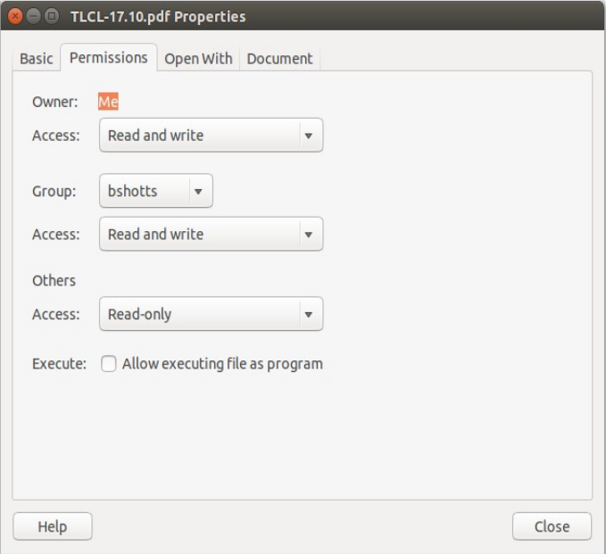

# 9 – Berechtigungen

Betriebssysteme der Unix-Familie unterscheiden sich in einem wichtigen Punkt von klassischen MS-DOS-Systemen:

Sie sind nicht nur **multitaskingfähig**, sondern auch **mehrbenutzerfähig** (_Multi-User-Systeme_).

## Was bedeutet „Mehrbenutzerfähig“?

Ein Mehrbenutzerbetriebssystem ermöglicht es mehreren Personen, denselben Computer gleichzeitig zu verwenden.

Auf einem typischen Heim-PC gibt es zwar meist nur eine Tastatur und einen Bildschirm, trotzdem können mehrere Benutzer gleichzeitig angemeldet sein.

Über das Netzwerk oder das Internet können sich Benutzer beispielsweise per **SSH (Secure Shell)** auf dem Rechner anmelden und dort arbeiten.

Dabei können sie nicht nur Befehle ausführen, sondern – je nach Konfiguration – sogar grafische Programme starten, deren Fenster auf ihrem eigenen Computer erscheinen.

Die Mehrbenutzerfähigkeit ist bei Linux keine spätere Erweiterung, sondern gehört seit den Anfängen zum grundlegenden Design des Betriebssystems.

Das hat historische Gründe.

Als Unix entstand, waren Computer keine persönlichen Geräte.

Sie waren groß, teuer und wurden zentral betrieben.

An Universitäten stand häufig ein leistungsfähiger Großrechner in einem Rechenzentrum, während über den gesamten Campus verteilt zahlreiche Terminals angeschlossen waren.

Alle Benutzer arbeiteten gleichzeitig auf demselben Rechner.

Damit dieses Konzept funktionierte, musste verhindert werden, dass Benutzer sich gegenseitig stören.

Niemand sollte versehentlich Dateien anderer Benutzer verändern oder gar das gesamte System beschädigen können.

Aus diesem Grund besitzt Unix seit jeher ein ausgefeiltes Berechtigungssystem.

## Warum ist das heute noch wichtig?

Auch auf einem Computer, der nur von einer einzigen Person genutzt wird, spielt dieses Sicherheitsmodell eine wichtige Rolle.

Im Alltag arbeitet man normalerweise mit einem gewöhnlichen Benutzerkonto.

Dieses besitzt **nicht** die Berechtigung, wichtige Systemdateien zu verändern.

Administrative Aufgaben werden stattdessen mit einem speziellen Administratorkonto oder temporär über Werkzeuge wie `sudo` ausgeführt.

Dadurch sinkt das Risiko erheblich, versehentlich das Betriebssystem oder wichtige Dateien zu beschädigen.

In diesem Kapitel lernen wir deshalb einen der wichtigsten Bestandteile der Linux-Sicherheit kennen.

Dabei begegnen uns unter anderem folgende Befehle:

- `id` – Informationen über einen Benutzer anzeigen
- `chmod` – Dateiberechtigungen ändern
- `umask` – Standardberechtigungen für neue Dateien festlegen
- `su` – Eine Shell als anderer Benutzer starten
- `sudo` – Einen einzelnen Befehl als anderer Benutzer ausführen
- `chown` – Besitzer einer Datei ändern
- `chgrp` – Gruppenzugehörigkeit einer Datei ändern
- `addgroup` – Benutzer oder Gruppen zum System hinzufügen
- `usermod` – Benutzerkonto ändern
- `passwd` – Passwort eines Benutzers ändern

## Benutzer, Gruppen und alle anderen

Vielleicht erinnerst du dich noch an Kapitel 3.

Damals konnten wir bestimmte Dateien nicht öffnen.

Zum Beispiel:

```bash
[me@linuxbox ~]$ file /etc/shadow
/etc/shadow: regular file, no read permission

[me@linuxbox ~]$ less /etc/shadow
/etc/shadow: Permission denied
```

Der Grund dafür ist einfach:

Als normaler Benutzer besitzen wir **keine Leseberechtigung** für diese Datei.

Und genau das ist beabsichtigt.

Die Datei `/etc/shadow` enthält sicherheitsrelevante Informationen über die Passwörter aller Benutzer des Systems und darf deshalb nur von privilegierten Benutzern gelesen werden.

:::
## Warum existieren `/etc/passwd` und `/etc/shadow`?

Früher waren Passwortinformationen direkt in `/etc/passwd` gespeichert.

Da diese Datei von allen Benutzern gelesen werden können muss, stellte das ein Sicherheitsproblem dar.

Deshalb wurden die Passwort-Hashes später in die geschützte Datei `/etc/shadow` ausgelagert.

Heute enthält `/etc/passwd` nur noch allgemeine Informationen über Benutzerkonten, während `/etc/shadow` ausschließlich für privilegierte Prozesse zugänglich ist.
:::

## Das Unix-Berechtigungsmodell

Das Berechtigungssystem von Unix basiert auf drei einfachen Rollen.

Jede Datei und jedes Verzeichnis besitzt:

- einen **Besitzer** (_Owner_)
- eine **Gruppe** (_Group_)
- **alle übrigen Benutzer** (_Others_)

Der Besitzer entscheidet, wer auf seine Dateien zugreifen darf.

Zusätzlich kann er einer Gruppe bestimmte Rechte einräumen.

Alle übrigen Benutzer fallen in die Kategorie **Others** (manchmal auch **World** genannt).

Dieses einfache Modell bildet bis heute die Grundlage des Linux-Berechtigungssystems.

Im weiteren Verlauf dieses Kapitels werden wir sehen, wie diese Rechte genau funktionieren.

## Informationen über den aktuellen Benutzer

Um Informationen über unser eigenes Benutzerkonto zu erhalten, verwenden wir den Befehl:

```bash
id
```

Beispiel:

```bash
[me@linuxbox ~]$ id
uid=500(me) gid=500(me) groups=500(me)
```

Schauen wir uns die einzelnen Bestandteile an.

Beim Anlegen eines Benutzerkontos vergibt Linux eine eindeutige **Benutzer-ID** (_User ID_, kurz **UID**).

Damit Menschen nicht mit Zahlen arbeiten müssen, wird diese UID zusätzlich einem Benutzernamen zugeordnet.

Außerdem besitzt jeder Benutzer eine **primäre Gruppe**, die durch die **Group ID (GID)** beschrieben wird.

Zusätzlich kann ein Benutzer Mitglied beliebig vieler weiterer Gruppen sein.

Unter Ubuntu könnte die Ausgabe beispielsweise so aussehen:

```bash
[me@linuxbox ~]$ id
uid=1000(me) gid=1000(me)
groups=4(adm),20(dialout),24(cdrom),25(floppy),29(audio),30(dip),44(video),46(plugdev),108(lpadmin),114(admin),1000(me)
```

Hier fällt auf, dass deutlich mehr Gruppen aufgeführt werden.

Das liegt daran, dass Ubuntu viele Systemberechtigungen über Gruppen organisiert.

So erhalten Mitglieder bestimmter Gruppen beispielsweise Zugriff auf

- Audiogeräte,
- Drucker,
- serielle Schnittstellen,
- CD/DVD-Laufwerke
- oder andere Hardware.

Die eigentlichen UID- und GID-Nummern unterscheiden sich ebenfalls zwischen Linux-Distributionen.

Fedora vergab Benutzerkonten früher ab UID **500**, während Ubuntu traditionell bei **1000** beginnt.

Die konkrete Zahl ist dabei nicht wichtig.

Entscheidend ist nur, dass jede UID eindeutig ist.

## Wo werden Benutzer gespeichert?

Auch diese Informationen stammen – wie so vieles unter Linux – aus einfachen Textdateien.

Die wichtigsten sind:

| Datei | Inhalt |
|--------|--------|
| `/etc/passwd` | Benutzerkonten |
| `/etc/group` | Gruppen |
| `/etc/shadow` | Passwort-Hashes und Passwortinformationen |

Beim Anlegen oder Ändern eines Benutzerkontos werden diese Dateien automatisch aktualisiert.

Für jedes Benutzerkonto enthält `/etc/passwd` unter anderem:

- den Benutzernamen,
- die UID,
- die primäre GID,
- den vollständigen Namen des Benutzers,
- das Home-Verzeichnis,
- sowie die Standard-Shell.

Wenn du einen Blick in `/etc/passwd` oder `/etc/group` wirfst, wirst du feststellen, dass dort weit mehr Benutzer existieren als nur dein eigenes Konto.

Neben dem **Superuser** (`root`, immer **UID 0**) findest du zahlreiche weitere Systembenutzer.

Diese gehören meist nicht zu echten Personen.

Stattdessen werden sie von Diensten und Hintergrundprogrammen verwendet.

Im nächsten Kapitel über Prozesse werden wir einigen dieser "Benutzer" wieder begegnen.

:::
## Eine Gruppe pro Benutzer

Früher war es üblich, alle normalen Benutzer einer gemeinsamen Gruppe wie `users` zuzuordnen.

Heute verfolgen die meisten Linux-Distributionen einen anderen Ansatz.

Für jeden Benutzer wird automatisch eine eigene Gruppe mit demselben Namen erstellt.

Ein Benutzer namens

```text
maru
```

besitzt daher häufig auch eine Gruppe

```text
maru
```

als primäre Gruppe.

Dieses sogenannte **User Private Group**-Konzept vereinfacht viele Berechtigungsregeln und hat sich heute weitgehend durchgesetzt.
:::

## Lesen, Schreiben und Ausführen

Das Unix-Berechtigungssystem basiert auf drei grundlegenden Rechten:

- **Lesen** (_Read_)
- **Schreiben** (_Write_)
- **Ausführen** (_Execute_)

Diese Rechte können unabhängig voneinander für verschiedene Benutzer vergeben werden.

Schauen wir uns zunächst ein einfaches Beispiel an.

```bash
[me@linuxbox ~]$ touch foo.txt
[me@linuxbox ~]$ ls -l foo.txt
-rw-rw-r-- 1 me me 0 2016-03-06 14:52 foo.txt
```

Der interessante Teil befindet sich ganz am Anfang der Ausgabe:

```text
-rw-rw-r--
```

Diese zehn Zeichen beschreiben den **Dateityp** und die **Berechtigungen** der Datei.

## Der Dateityp

Das erste Zeichen gibt an, **welchen Typ** die Datei besitzt.

Die häufigsten Dateitypen sind:

| Zeichen | Bedeutung |
|----------|-----------|
| `-` | Normale Datei |
| `d` | Verzeichnis |
| `l` | Symbolischer Link |
| `c` | Zeichenorientierte Gerätedatei (_Character Device_), z. B. Terminal oder `/dev/null` |
| `b` | Blockorientierte Gerätedatei (_Block Device_), z. B. Festplatten, SSDs oder DVD-Laufwerke |

### Symbolische Links

Bei symbolischen Links fällt häufig Folgendes auf:

```text
lrwxrwxrwx
```

Die Berechtigungen sehen so aus, als dürfte jeder alles.

Tatsächlich sind diese Werte jedoch **ohne Bedeutung**.

Entscheidend sind immer die Berechtigungen der Datei oder des Verzeichnisses, auf das der symbolische Link verweist.

Deshalb besitzen symbolische Links praktisch immer dieselben scheinbaren Rechte:

```text
rwxrwxrwx
```

:::
## Warum zeigt `ls` trotzdem Berechtigungen an?

Historisch besitzt auch ein symbolischer Link einen sogenannten _Mode_.

Linux ignoriert diesen jedoch beim Zugriff.

Aus Gründen der Kompatibilität zeigt `ls` trotzdem die bekannten Zeichen `rwxrwxrwx` an.

Für die tatsächlichen Zugriffsrechte zählt ausschließlich das Ziel des Links.
:::

## Die neun Berechtigungszeichen

Nach dem Dateityp folgen neun weitere Zeichen:

```text
-rw-rw-r--
```

Diese werden immer in drei Dreiergruppen aufgeteilt:

```text
-rw- rw- r--
 ^^^ ^^^ ^^^
Owner Group Others
```

Sie beschreiben die Rechte für

- den **Besitzer** (_Owner_)
- die **Gruppe** (_Group_)
- **alle übrigen Benutzer** (_Others_)

Jede Gruppe besteht wiederum aus drei möglichen Berechtigungen:

```text
rwx
```

Dabei bedeuten:

- `r` → Lesen (_Read_)
- `w` → Schreiben (_Write_)
- `x` → Ausführen (_Execute_)

Fehlt ein Recht, erscheint an seiner Stelle ein Minuszeichen (`-`).

Beispielsweise bedeutet

```text
rw-
```

dass gelesen und geschrieben werden darf, das Ausführen jedoch nicht erlaubt ist.

---

## Bedeutung der einzelnen Berechtigungen

Die Bedeutung von `r`, `w` und `x` unterscheidet sich leicht zwischen Dateien und Verzeichnissen.

| Recht | Dateien | Verzeichnisse |
|--------|----------|---------------|
| `r` | Datei lesen | Inhalt des Verzeichnisses auflisten (`ls`) |
| `w` | Datei verändern oder überschreiben | Dateien anlegen, löschen oder umbenennen (zusammen mit `x`) |
| `x` | Datei als Programm ausführen | Verzeichnis betreten (`cd`) und auf darin enthaltene Dateien zugreifen |

### Leserecht (`r`)

Bei einer Datei bedeutet `r`, dass ihr Inhalt gelesen werden darf.

Bei einem Verzeichnis erlaubt `r`, dessen Inhalt aufzulisten.

Ohne zusätzliches `x` erhältst du allerdings meist nur die Dateinamen, nicht aber weitere Informationen wie Größe oder Berechtigungen.

### Schreibrecht (`w`)

Bei einer Datei erlaubt `w`, ihren Inhalt zu verändern.

Interessanterweise genügt dieses Recht **nicht**, um die Datei umzubenennen oder zu löschen.

Ob eine Datei gelöscht werden darf, entscheidet nämlich das Verzeichnis, in dem sie liegt.

Bei Verzeichnissen erlaubt `w` (zusammen mit `x`)

- neue Dateien anzulegen,
- Dateien zu löschen,
- und Dateien umzubenennen.

:::
## Warum löscht man eine Datei über das Verzeichnis?

Das wirkt zunächst ungewohnt.

Unter Unix wird beim Löschen nämlich nicht die Datei selbst verändert.

Stattdessen wird lediglich ihr **Eintrag im Verzeichnis** entfernt.

Deshalb benötigt `rm` Schreibrechte auf dem Verzeichnis – nicht auf der Datei.

Diese Besonderheit sorgt bei Linux-Einsteigern häufig für Verwirrung.
:::

### Ausführungsrecht (`x`)

Bei Dateien erlaubt `x`, die Datei als Programm zu starten.

Handelt es sich um ein Shell- oder Python-Skript, muss die Datei zusätzlich lesbar sein, damit der Interpreter ihren Inhalt überhaupt laden kann.

Bei Verzeichnissen besitzt `x` eine völlig andere Bedeutung.

Hier erlaubt es,

- das Verzeichnis zu betreten (`cd`),
- auf Dateien innerhalb des Verzeichnisses zuzugreifen,
- sowie Befehle wie `cp`, `mv` oder `rm` auf diese Dateien anzuwenden.

Das Ausführungsrecht auf Verzeichnissen wird deshalb manchmal auch als **Durchsuchungsrecht** (_Search Permission_) bezeichnet.

## Beispiele

Ein paar typische Berechtigungen lassen sich nun leicht lesen.

| Berechtigungen | Bedeutung |
|----------------|-----------|
| `-rwx------` | Nur der Besitzer darf lesen, schreiben und ausführen. |
| `-rw-------` | Nur der Besitzer darf lesen und schreiben. |
| `-rw-r--r--` | Besitzer: lesen und schreiben. Gruppe und andere: nur lesen. |
| `-rwxr-xr-x` | Besitzer: lesen, schreiben und ausführen. Alle anderen: lesen und ausführen. |
| `-rw-rw----` | Besitzer und Gruppe dürfen lesen und schreiben. Andere haben keinen Zugriff. |
| `lrwxrwxrwx` | Symbolischer Link. Die angezeigten Berechtigungen sind bedeutungslos; maßgeblich sind die Rechte des Ziels. |
| `drwxrwx---` | Besitzer und Gruppe dürfen das Verzeichnis betreten sowie Dateien anlegen, löschen und umbenennen. |
| `drwxr-x---` | Besitzer darf alles. Gruppenmitglieder dürfen das Verzeichnis betreten und lesen, aber keine Dateien anlegen, löschen oder umbenennen. |

:::
## Berechtigungen lesen lernen

Anfangs wirken Zeichenfolgen wie

```text
-rwxr-xr-x
```

ziemlich kryptisch.

Mit etwas Übung lassen sie sich jedoch auf einen Blick erkennen.

Ein guter Trick besteht darin, sie immer in vier Teile zu zerlegen:

```text
- | rwx | r-x | r-x
```

1. **Dateityp**
2. **Besitzer**
3. **Gruppe**
4. **Andere**

Fast alle Linux-Werkzeuge verwenden genau dieses Schema.

Es lohnt sich also, sich früh daran zu gewöhnen.
:::

## `chmod` – Dateiberechtigungen ändern

Um die Berechtigungen einer Datei oder eines Verzeichnisses zu ändern, verwendet man den Befehl `chmod`.

Dabei gilt eine wichtige Regel:

Nur

- der **Besitzer** einer Datei
- oder der **Superuser** (`root`)

dürfen ihre Berechtigungen ändern.

`chmod` unterstützt zwei verschiedene Schreibweisen:

1. **Oktale Schreibweise** (Zahlen wie `755` oder `644`)
2. **Symbolische Schreibweise** (z. B. `u+x` oder `go=rw`)

Beginnen wir mit der oktalen Schreibweise.

## Was ist eigentlich Oktal?

Bevor wir verstehen können, warum Berechtigungen häufig mit Zahlen wie

```text
755
```

oder

```text
644
```

geschrieben werden, müssen wir einen kurzen Blick auf Zahlensysteme werfen.

Wir Menschen verwenden im Alltag das **Dezimalsystem** (_Basis 10_).

Das liegt vermutlich daran, dass wir zehn Finger besitzen.

Wir zählen also so:

```text
0, 1, 2, 3, 4, 5, 6, 7, 8, 9, 10, 11, 12 ...
```

Computer arbeiten dagegen intern ausschließlich mit zwei Zuständen:

- an
- aus

Deshalb verwenden sie das **Binärsystem** (_Basis 2_).

Dort existieren nur die Ziffern

```text
0 und 1
```

Gezählt wird beispielsweise so:

```text
0
1
10
11
100
101
110
111
1000
...
```

Ein weiteres Zahlensystem ist das **Oktalsystem** (_Basis 8_).

Es verwendet nur die Ziffern

```text
0 bis 7
```

und zählt deshalb so:

```text
0, 1, 2, 3, 4, 5, 6, 7, 10, 12, 13, 14, 15, 16, 17, 20, 21, ...
```

Daneben gibt es noch das **Hexadezimalsystem** (_Basis 16_).

Es verwendet

```text
0–9 sowie A–F
```

und zählt beispielsweise:

```text
0, 1, 2, ..., 9, A, B, C, D, E, F, 10, 11 ...
```

## Warum verwendet Linux überhaupt Oktal?

Auf den ersten Blick wirken Zahlensysteme wie Oktal oder Hexadezimal ziemlich unnötig.

Warum nicht einfach alles dezimal schreiben?

Der Grund liegt in der Darstellung von **Binärdaten**.

Viele Informationen im Computer bestehen intern lediglich aus einzelnen Bits.

Ein gutes Beispiel ist eine Farbe auf dem Bildschirm.

Ein Pixel besteht meist aus

- 8 Bit Rot
- 8 Bit Grün
- 8 Bit Blau

Zusammen ergibt das 24 Bit.

Eine Farbe könnte intern so aussehen:

```text
010000110110111111001101
```

Das lässt sich nur schwer lesen.

Im Hexadezimalsystem wird dieselbe Zahl wesentlich kompakter dargestellt:

```text
436FCD
```

Hier erkennt man sogar direkt die drei Farbanteile:

- Rot → `43`
- Grün → `6F`
- Blau → `CD`

Hexadezimal wird deshalb bis heute häufig verwendet, etwa für Farben im Web oder Speicheradressen.

## Warum gerade Oktal für Berechtigungen?

Während Hexadezimal hervorragend zu Vierergruppen von Bits passt, eignet sich **Oktal** perfekt für **Dreiergruppen**.

Und genau aus drei Bits besteht jede Berechtigungsgruppe.

Schauen wir uns die drei Berechtigungen noch einmal an:

```text
r w x
```

Jede Berechtigung kann entweder gesetzt oder nicht gesetzt sein.

Das ergibt genau drei Bits.

| Oktal | Binär | Berechtigungen |
|-------:|:-----:|----------------|
| 0 | `000` | `---` |
| 1 | `001` | `--x` |
| 2 | `010` | `-w-` |
| 3 | `011` | `-wx` |
| 4 | `100` | `r--` |
| 5 | `101` | `r-x` |
| 6 | `110` | `rw-` |
| 7 | `111` | `rwx` |

Deshalb kann jede Dreiergruppe der Berechtigungen durch **eine einzige Oktalziffer** dargestellt werden.

## Ein Beispiel

Unsere Datei besitzt zunächst folgende Rechte:

```bash
[me@linuxbox ~]$ touch foo.txt
[me@linuxbox ~]$ ls -l foo.txt
-rw-rw-r-- 1 me me 0 2016-03-06 14:52 foo.txt
```

Nun ändern wir die Berechtigungen:

```bash
[me@linuxbox ~]$ chmod 600 foo.txt
```

Danach sieht die Ausgabe so aus:

```bash
[me@linuxbox ~]$ ls -l foo.txt
-rw------- 1 me me 0 2016-03-06 14:52 foo.txt
```

Die Zahl

```text
600
```

bedeutet:

```text
6   0   0
│   │   │
│   │   └── Others
│   └────── Group
└────────── Owner
```

Schauen wir uns die erste Ziffer an:

```text
6
```

Aus der Tabelle wissen wir:

```text
6 = rw-
```

Die übrigen beiden Ziffern sind

```text
0 = ---
```

Somit ergibt sich:

```text
rw- --- ---
```

also genau

```text
-rw-------
```

Nur der Besitzer darf lesen und schreiben.

Alle anderen besitzen keinerlei Rechte.

:::
## Die fünf wichtigsten Zahlen

Zum Glück muss man sich nicht alle acht Kombinationen merken.

In der Praxis begegnen dir fast ausschließlich diese fünf:

| Oktal | Berechtigungen |
|-------:|----------------|
| `7` | `rwx` |
| `6` | `rw-` |
| `5` | `r-x` |
| `4` | `r--` |
| `0` | `---` |

Aus ihnen lassen sich praktisch alle üblichen Berechtigungen zusammensetzen.
:::

## Symbolische Schreibweise

Neben Zahlen unterstützt `chmod` auch eine besser lesbare Schreibweise.

Dabei besteht jede Angabe aus drei Teilen:

1. **Wer** soll geändert werden?
2. **Welche Operation** soll durchgeführt werden?
3. **Welche Berechtigung** betrifft die Änderung?

### Wer?

| Symbol | Bedeutung |
|--------|-----------|
| `u` | Besitzer (_User_) |
| `g` | Gruppe (_Group_) |
| `o` | Andere (_Others_) |
| `a` | Alle (_All_) |

Wird kein Buchstabe angegeben, verwendet `chmod` automatisch `a` (alle).

### Welche Operation?

| Symbol | Bedeutung |
|--------|-----------|
| `+` | Berechtigung hinzufügen |
| `-` | Berechtigung entfernen |
| `=` | Genau diese Berechtigungen setzen und alle anderen entfernen |

### Welche Berechtigungen?

Wie gewohnt werden die drei Buchstaben verwendet:

```text
r  w  x
```

## Beispiele

| Befehl | Bedeutung |
|--------|-----------|
| `chmod u+x datei` | Besitzer erhält Ausführungsrecht. |
| `chmod u-x datei` | Ausführungsrecht des Besitzers entfernen. |
| `chmod +x datei` | Alle erhalten Ausführungsrecht (entspricht `a+x`). |
| `chmod o-rw datei` | Anderen Benutzern Lese- und Schreibrechte entziehen. |
| `chmod go=rw datei` | Gruppe und Andere erhalten genau Lese- und Schreibrechte. Vorhandene Ausführungsrechte werden entfernt. |
| `chmod u+x,go=rx datei` | Besitzer erhält zusätzlich Ausführungsrecht. Gruppe und Andere erhalten genau Lese- und Ausführungsrechte. |

Mehrere Änderungen können durch Kommas getrennt werden.

## Oktal oder symbolisch?

Beide Schreibweisen sind gleichwertig.

Viele Administratoren verwenden lieber die Oktalschreibweise:

```bash
chmod 755 script.sh
chmod 644 dokument.txt
```

Andere bevorzugen die symbolische Schreibweise:

```bash
chmod u+x script.sh
```

Der größte Vorteil der symbolischen Schreibweise besteht darin, dass sich **einzelne Berechtigungen ändern lassen**, ohne alle übrigen Rechte neu festlegen zu müssen.

Beispielsweise ergänzt

```bash
chmod u+x script.sh
```

lediglich das Ausführungsrecht des Besitzers.

Alle anderen Berechtigungen bleiben unverändert.

:::
## Vorsicht bei `chmod -R`

`chmod` besitzt die Option

```bash
-R
```

(_rekursiv_).

Damit werden die Berechtigungen aller Dateien und Unterverzeichnisse geändert.

Das klingt praktisch, kann aber leicht zu unerwarteten Ergebnissen führen.

Dateien und Verzeichnisse benötigen nämlich oft unterschiedliche Berechtigungen.

Während Programme häufig ausführbar sein müssen, gilt das für normale Textdateien meist nicht.

Verwende `chmod -R` deshalb mit Bedacht und prüfe genau, welche Dateien betroffen sind.
:::

## Dateiberechtigungen in grafischen Dateimanagern

Nachdem wir nun wissen, wie Dateiberechtigungen funktionieren, können wir auch die entsprechenden Dialoge grafischer Dateimanager besser verstehen.

Sowohl **Files (GNOME)** als auch **Dolphin (KDE)** bieten einen Eigenschaften-Dialog für Dateien und Verzeichnisse.

Dazu genügt ein Rechtsklick auf eine Datei oder ein Verzeichnis und anschließend **Eigenschaften**.



Hier lassen sich die Berechtigungen für

- den **Besitzer**,
- die **Gruppe**
- und **alle anderen Benutzer**

komfortabel anzeigen und – je nach Dateimanager – auch ändern.

Die grafische Oberfläche verwendet dabei dasselbe Berechtigungssystem wie `chmod`.

Es handelt sich lediglich um eine andere Darstellung derselben Rechte.

:::
## GUI oder Terminal?

Für gelegentliche Änderungen ist der grafische Eigenschaften-Dialog völlig ausreichend.

Wer jedoch häufiger mit Linux arbeitet oder viele Dateien gleichzeitig bearbeiten möchte, wird meist schneller mit `chmod` arbeiten.

Gerade in Shell-Skripten oder bei der Administration mehrerer Systeme führt ohnehin kein Weg an der Kommandozeile vorbei.
:::

# `umask` – Standardberechtigungen festlegen

Bisher haben wir gesehen, wie sich Berechtigungen **nachträglich** mit `chmod` ändern lassen.

Doch welche Berechtigungen erhält eine Datei eigentlich **beim Erstellen**?

Genau dafür gibt es den Befehl

```bash
umask
```

Der Name **Umask** stammt von _User Mask_.

Anstatt festzulegen, welche Berechtigungen eine neue Datei erhalten soll, arbeitet die Umask genau umgekehrt: Sie beschreibt, **welche Berechtigungen entfernt werden**.

Man kann sie sich wie eine Schablone vorstellen, die bestimmte Rechte "abdeckt" (maskiert), bevor die Datei angelegt wird.

## Die aktuelle Umask anzeigen

Zunächst löschen wir eine eventuell vorhandene Datei:

```bash
[me@linuxbox ~]$ rm -f foo.txt
```

Nun zeigen wir die aktuelle Umask an:

```bash
[me@linuxbox ~]$ umask
0002
```

Die Ausgabe erfolgt – wie bei `chmod` – in Oktalschreibweise.

Erstellen wir nun eine neue Datei:

```bash
[me@linuxbox ~]$ > foo.txt
```

und betrachten ihre Berechtigungen:

```bash
[me@linuxbox ~]$ ls -l foo.txt
-rw-rw-r-- 1 me me 0 2025-03-06 14:53 foo.txt
```

Die Datei besitzt also:

```text
rw- rw- r--
```

Der Besitzer und die Gruppe dürfen lesen und schreiben.

Alle anderen besitzen nur Leserechte.

## Die Umask ändern

Setzen wir die Umask nun testweise auf

```text
0000
```

```bash
[me@linuxbox ~]$ rm foo.txt
[me@linuxbox ~]$ umask 0000
[me@linuxbox ~]$ > foo.txt
[me@linuxbox ~]$ ls -l foo.txt
-rw-rw-rw- 1 me me 0 2025-03-06 14:58 foo.txt
```

Jetzt dürfen plötzlich **alle Benutzer schreiben**.

Warum?

Weil die Umask diesmal keinerlei Rechte entfernt.

## Wie funktioniert die Umask?

Neue Dateien starten normalerweise mit den Rechten

```text
rw- rw- rw-
```

Die Umask entfernt anschließend einzelne Berechtigungen.

Schauen wir uns die Umask

```text
0002
```

an.

| Ausgangsrechte | `rw- rw- rw-` |
|----------------|---------------|
| Umask | `000 000 000 010` |
| Ergebnis | `rw- rw- r--` |

Dort, wo in der Umask eine **1** steht, verschwindet das entsprechende Recht.

In diesem Beispiel wird lediglich das Schreibrecht für **Others** entfernt.

Betrachten wir nun die übliche Umask

```text
0022
```

| Ausgangsrechte | `rw- rw- rw-` |
|----------------|---------------|
| Umask | `000 000 010 010` |
| Ergebnis | `rw- r-- r--` |

Jetzt verlieren sowohl

- die Gruppe
- als auch alle anderen

ihr Schreibrecht.

:::
## Ein Merksatz zur Umask

`chmod` beschreibt die Berechtigungen, **die eine Datei haben soll**.

`umask` beschreibt dagegen die Berechtigungen, **die entfernt werden sollen**.

Viele Linux-Einsteiger verwechseln diese beiden Konzepte zunächst.

Ein einfacher Merksatz lautet deshalb:

**`chmod` gibt Rechte. `umask` nimmt Rechte weg.**
:::

Du kannst ruhig etwas mit verschiedenen Werten experimentieren – zum Beispiel mit `0007` oder `0077` –, um ein Gefühl dafür zu bekommen.

Vergiss anschließend nicht, den ursprünglichen Zustand wiederherzustellen:

```bash
[me@linuxbox ~]$ rm foo.txt
[me@linuxbox ~]$ umask 0002
```

In den meisten Fällen musst du die Umask übrigens gar nicht ändern.

Die Standardwerte deiner Linux-Distribution sind für den Alltag meist gut gewählt.

Lediglich in besonders sicherheitskritischen Umgebungen wird die Umask häufig angepasst.

# Besondere Berechtigungen

Bisher haben wir Berechtigungen immer mit **drei Oktalziffern** beschrieben.

Genauer betrachtet besitzt der Berechtigungsmodus jedoch **vier** Stellen.

Die zusätzliche Stelle steht für einige besondere Berechtigungen, die deutlich seltener verwendet werden.

Sie sind:

- **setuid** (`4000`)
- **setgid** (`2000`)
- **Sticky Bit** (`1000`)

## `setuid`

Das **setuid-Bit** besitzt den Oktalwert

```text
4000
```

Es kann auf ausführbaren Programmen gesetzt werden.

Wird ein solches Programm gestartet, läuft es **nicht** mit den Rechten des aufrufenden Benutzers, sondern mit den Rechten des Dateibesitzers.

Am häufigsten gehört dieser Besitzer dem Benutzer

```text
root
```

an.

Dadurch kann ein normales Benutzerprogramm kurzzeitig administrative Aufgaben erledigen.

Bekannte Programme wie

```text
passwd
```

verwenden dieses Prinzip, damit jeder Benutzer sein eigenes Passwort ändern kann, obwohl dafür eigentlich Schreibzugriff auf geschützte Systemdateien erforderlich ist.

Da Programme mit `setuid` erhöhte Rechte besitzen, sollten sie äußerst sparsam eingesetzt werden.

## `setgid`

Das **setgid-Bit**

```text
2000
```

funktioniert ähnlich, wirkt jedoch auf die **Gruppe**.

Bei Programmen übernimmt der Prozess die Gruppen-ID des Dateibesitzers.

Noch häufiger wird `setgid` jedoch auf **Verzeichnissen** verwendet.

Neue Dateien erhalten dann automatisch dieselbe Gruppe wie das Verzeichnis – unabhängig davon, welche primäre Gruppe ihr Ersteller besitzt.

Das ist besonders praktisch in gemeinsam genutzten Projektverzeichnissen.

## Das Sticky Bit

Das **Sticky Bit**

```text
1000
```

hat heute fast ausschließlich auf **Verzeichnissen** Bedeutung.

Ist es gesetzt, dürfen Dateien nur gelöscht oder umbenannt werden von

- ihrem Besitzer,
- dem Besitzer des Verzeichnisses
- oder `root`.

Ein klassisches Beispiel ist

```text
/tmp
```

Dort dürfen alle Benutzer Dateien anlegen.

Ohne Sticky Bit könnte jedoch jeder die Dateien anderer Benutzer löschen.

Deshalb besitzt `/tmp` üblicherweise das Sticky Bit.

:::
## Historischer Hintergrund

Ursprünglich hatte das Sticky Bit auf ausführbaren Programmen eine völlig andere Funktion.

Es sorgte dafür, dass Programme nach dem Beenden im Arbeitsspeicher blieben und dadurch schneller erneut gestartet werden konnten.

Moderne Linux-Systeme ignorieren dieses Verhalten.

Heute spielt das Sticky Bit praktisch nur noch bei Verzeichnissen eine Rolle.
:::

## Besondere Berechtigungen setzen

Die symbolische Schreibweise ist meist am einfachsten.

### `setuid`

```bash
chmod u+s programm
```

### `setgid`

```bash
chmod g+s verzeichnis
```

### Sticky Bit

```bash
chmod +t verzeichnis
```

## Besondere Berechtigungen erkennen

Auch `ls -l` zeigt diese Berechtigungen an.

Ein Programm mit `setuid`:

```text
-rwsr-xr-x
```

Das `s` ersetzt das Ausführungsrecht des Besitzers.

Ein Verzeichnis mit `setgid`:

```text
drwxrwsr-x
```

Hier ersetzt das `s` das Ausführungsrecht der Gruppe.

Ein Verzeichnis mit Sticky Bit:

```text
drwxrwxrwt
```

Das `t` erscheint an der Stelle des Ausführungsrechts für **Others**.

:::
## Diese Rechte brauchst du nicht auswendig zu lernen

Im normalen Linux-Alltag wirst du hauptsächlich mit den klassischen Berechtigungen (`r`, `w` und `x`) arbeiten.

`setuid`, `setgid` und das Sticky Bit begegnen dir deutlich seltener.

Es genügt zunächst zu wissen, **dass** sie existieren und welchen grundsätzlichen Zweck sie erfüllen.

Später, wenn du Systeme administrierst oder Server betreust, wirst du ihnen automatisch häufiger begegnen.
:::

# Benutzeridentitäten wechseln

Bisher haben wir alle Befehle unter unserem eigenen Benutzerkonto ausgeführt.

Manchmal ist es jedoch notwendig, vorübergehend **die Identität eines anderen Benutzers anzunehmen**.

Am häufigsten geschieht das, um administrative Aufgaben als **`root`** auszuführen.

Es kann aber auch sinnvoll sein, sich als ein anderer normaler Benutzer auszugeben – beispielsweise, um dessen Einstellungen oder Berechtigungen zu testen.

Dafür gibt es grundsätzlich drei Möglichkeiten:

1. Abmelden und als anderer Benutzer wieder anmelden.
2. Den Befehl `su` verwenden.
3. Den Befehl `sudo` verwenden.

Die erste Möglichkeit kennen wir bereits und sie ist im Alltag eher umständlich.

Deshalb konzentrieren wir uns auf die beiden Befehle `su` und `sudo`.

Mit `su` kannst du innerhalb deiner aktuellen Shell die Identität eines anderen Benutzers annehmen. Dabei lässt sich entweder eine neue Shell starten oder nur ein einzelner Befehl als dieser Benutzer ausführen.

`sudo` verfolgt einen anderen Ansatz.

Hier entscheidet eine Konfigurationsdatei namens

```text
/etc/sudoers
```

welche Benutzer welche Befehle mit erweiterten Rechten ausführen dürfen.

Welche der beiden Methoden hauptsächlich verwendet wird, hängt von deiner Linux-Distribution ab.

Die meisten Distributionen bringen zwar beide Programme mit, bevorzugen heute jedoch `sudo`.

Wir beginnen trotzdem mit `su`, da sich daran gut erklären lässt, wie Benutzeridentitäten unter Linux funktionieren.

:::
## `su` oder `sudo`?

Früher wurde für administrative Aufgaben häufig `su` verwendet.

Heute setzen fast alle Linux-Distributionen standardmäßig auf `sudo`.

Der Grund ist einfach:

Mit `sudo` lassen sich einzelnen Benutzern gezielt bestimmte Administratorrechte geben, ohne ihnen das `root`-Passwort verraten zu müssen.

Dadurch lässt sich besser nachvollziehen, **wer** welche administrativen Befehle ausgeführt hat.
:::

---

# `su` – Eine Shell als anderer Benutzer starten

Der Name `su` steht für **Substitute User**.

Mit diesem Befehl kannst du eine neue Shell als ein anderer Benutzer starten.

Die Syntax lautet:

```bash
su [-l] [Benutzer]
```

Wird die Option

```text
-l
```

angegeben, startet `su` eine sogenannte **Login-Shell**.

Dabei geschieht Folgendes:

- die Umgebung des Benutzers wird geladen,
- seine Shell-Konfiguration wird eingelesen,
- und das aktuelle Arbeitsverzeichnis wechselt in sein Home-Verzeichnis.

Genau dieses Verhalten ist in den meisten Fällen erwünscht.

Aus diesem Grund wird `-l` fast immer verwendet.

Praktischerweise darf die Option einfach als einzelnes Minuszeichen geschrieben werden:

```bash
su -
```

Lässt du den Benutzernamen weg, geht `su` automatisch davon aus, dass du `root` meinst.

---

## Zu `root` wechseln

Früher besaß der Benutzer `root` normalerweise ein eigenes Passwort.

Dann konnte man mit folgendem Befehl Administrator werden:

```bash
[me@linuxbox ~]$ su -
Password:
[root@linuxbox ~]#
```

Nach Eingabe des korrekten Passworts startet eine neue Shell.

Dass du nun als Administrator arbeitest, erkennst du sofort am Prompt:

```text
#
```

anstelle von

```text
$
```

Außerdem befindest du dich nun im Home-Verzeichnis von `root`, das normalerweise

```text
/root
```

heißt.

Jetzt kannst du beliebige Administratorbefehle ausführen.

Zum Verlassen genügt anschließend:

```bash
[root@linuxbox ~]# exit
[me@linuxbox ~]$
```

Damit kehrst du wieder zu deiner ursprünglichen Shell zurück.

:::
## Warum funktioniert `su` auf vielen Systemen nicht?

Auf modernen Linux-Distributionen besitzt der Benutzer `root` häufig **gar kein eigenes Passwort**.

Stattdessen wird das Administratorkonto standardmäßig gesperrt und administrative Aufgaben erfolgen ausschließlich über `sudo`.

Versuchst du auf einem solchen System `su -`, erhältst du daher meist nur eine Passwortabfrage, die sich nicht erfolgreich beantworten lässt.

Das ist kein Fehler, sondern eine bewusste Sicherheitsentscheidung der Distribution.
:::

---

## Einen einzelnen Befehl ausführen

Nicht immer möchte man eine komplette neue Shell starten.

`su` kann auch genau einen einzelnen Befehl als anderer Benutzer ausführen.

Dazu dient die Option

```bash
-c
```

Die Syntax lautet:

```bash
su -c 'Befehl'
```

Beispiel:

```bash
[me@linuxbox ~]$ su -c 'ls -l /root/*'
Password:
-rw------- 1 root root 754 2025-08-11 03:19 /root/anaconda-ks.cfg

/root/Mail:
total 0
[me@linuxbox ~]$
```

Hier wird lediglich der Befehl

```bash
ls -l /root/*
```

mit den Rechten von `root` ausgeführt.

Danach kehrt `su` sofort wieder zu deiner normalen Shell zurück.

---

## Warum stehen Anführungszeichen um den Befehl?

Der Befehl wird bewusst in einfache Anführungszeichen gesetzt:

```bash
su -c 'ls -l /root/*'
```

Der Grund dafür ist die **Shell Expansion**, die wir bereits in Kapitel 7 kennengelernt haben.

Ohne die Anführungszeichen würde deine aktuelle Shell den Befehl bereits auswerten, bevor `su` ihn überhaupt erhält.

Mit den einfachen Anführungszeichen wird der gesamte Befehl unverändert an die neue Shell übergeben.

Erst dort werden beispielsweise Wildcards wie

```text
*
```

oder Variablen ausgewertet.

Dadurch arbeitet der Befehl genau so, als wäre er direkt in der neuen Shell eingegeben worden.

:::
## Warum einfache und keine doppelten Anführungszeichen?

Für `su -c` werden meist **einfache Anführungszeichen** (`'...'`) verwendet.

Sie verhindern zuverlässig, dass Variablen, Wildcards oder andere Shell-Erweiterungen bereits in der aktuellen Shell ausgewertet werden.

Die neue Shell erhält den Befehl dadurch unverändert und kann ihn selbst interpretieren.
:::

# `sudo` – Einen Befehl als anderer Benutzer ausführen

Der Befehl `sudo` ähnelt `su`, besitzt jedoch einige wichtige zusätzliche Möglichkeiten.

Ein Administrator kann `sudo` so konfigurieren, dass ein normaler Benutzer bestimmte Befehle unter der Identität eines anderen Benutzers ausführen darf – meistens als `root`.

Dabei lässt sich sehr genau festlegen,

- welcher Benutzer `sudo` verwenden darf,
- als welcher andere Benutzer ein Befehl ausgeführt wird,
- und welche Befehle erlaubt sind.

Ein Benutzer kann beispielsweise die Berechtigung erhalten, genau ein bestimmtes Verwaltungsprogramm auszuführen, ohne dadurch vollständigen Zugriff auf das gesamte System zu bekommen.

---

## Das eigene Passwort statt des `root`-Passworts

Ein wichtiger Unterschied zu `su` besteht in der Anmeldung.

Bei `su` wird normalerweise das Passwort des Zielbenutzers verlangt – beim Wechsel zu `root` also das `root`-Passwort.

Bei `sudo` gibst du dagegen **dein eigenes Passwort** ein.

Angenommen, ein fiktives Sicherungsprogramm namens `backup_script` benötigt Administratorrechte und wurde für deinen Benutzer freigegeben.

Dann könnte der Aufruf so aussehen:

```bash
[me@linuxbox ~]$ sudo backup_script
Password:
System Backup Starting...
```

Nach Eingabe deines Passworts prüft `sudo`, ob du diesen Befehl ausführen darfst.

Ist das der Fall, wird ausschließlich der angegebene Befehl mit den entsprechenden Rechten gestartet.

:::note
## Welches Passwort erwartet `sudo`?

`sudo` fragt normalerweise nach dem Passwort des **aktuell angemeldeten Benutzers**.

Es erwartet nicht das Passwort von `root`.

Das ist ein häufiger Stolperstein, wenn man `sudo` zum ersten Mal verwendet.
:::

---

## `sudo` startet normalerweise keine neue Shell

Bei einem gewöhnlichen Aufruf wie

```bash
sudo befehl
```

startet `sudo` keine dauerhafte neue Shell.

Es führt lediglich diesen einen Befehl mit einer anderen Identität aus und kehrt danach zur normalen Shell zurück.

Auch die vollständige Umgebung eines anderen Benutzers wird dabei normalerweise nicht geladen.

Deshalb schreibst du den Befehl grundsätzlich genauso, wie du ihn auch ohne `sudo` schreiben würdest:

```bash
sudo ls -l /root
```

Es sind keine zusätzlichen Anführungszeichen wie bei

```bash
su -c 'ls -l /root'
```

notwendig.

Dieses Verhalten kann mit verschiedenen Optionen verändert werden.

Eine interaktive Login-Shell als `root` lässt sich beispielsweise mit folgender Option starten:

```bash
sudo -i
```

Das verhält sich in vieler Hinsicht ähnlich wie:

```bash
su -
```

Zum Verlassen der Shell verwendest du wieder:

```bash
exit
```

:::note
## `sudo -i` nicht unnötig lange offen lassen

Mit `sudo -i` arbeitest du dauerhaft mit Administratorrechten, bis du die Shell wieder verlässt.

Damit geht ein wichtiger Vorteil von `sudo` teilweise verloren: Normalerweise werden nur einzelne, bewusst ausgewählte Befehle mit erhöhten Rechten ausgeführt.

Verwende eine dauerhafte `root`-Shell deshalb nur, wenn sie für mehrere zusammenhängende Arbeitsschritte wirklich nötig ist.
:::

---

## Erlaubte Befehle anzeigen

Mit der Option `-l` kannst du prüfen, welche Rechte dir über `sudo` zugewiesen wurden:

```bash
[me@linuxbox ~]$ sudo -l
User me may run the following commands on this host:
    (ALL) ALL
```

Die Ausgabe

```text
(ALL) ALL
```

bedeutet vereinfacht gesagt, dass der Benutzer `me` alle Befehle als beliebiger Benutzer ausführen darf.

Auf stärker eingeschränkten Systemen könnten dort stattdessen nur einzelne Programme stehen.

Beispielsweise:

```text
(root) /usr/bin/systemctl restart apache2
```

In diesem Fall dürfte der Benutzer ausschließlich diesen konkreten Befehl mit `root`-Rechten ausführen.

---

# Moderne Linux-Distributionen und `sudo`

Eine der häufigsten Schwierigkeiten für normale Benutzer besteht darin, Aufgaben auszuführen, die Administratorrechte benötigen.

Dazu gehören beispielsweise:

- Software installieren oder aktualisieren,
- Systemkonfigurationen bearbeiten,
- Dienste starten oder stoppen,
- auf geschützte Geräte oder Dateien zugreifen.

Eine einfache Lösung wäre, einem Benutzer dauerhaft Administratorrechte zu geben.

Das wäre allerdings gefährlich.

Programme, die dieser Benutzer startet, würden dann ebenfalls mit denselben weitreichenden Rechten laufen. Schadsoftware oder ein versehentlich falsch eingegebener Befehl könnte dadurch das gesamte System verändern oder beschädigen.

Unix-Systeme verfolgen traditionell einen anderen Ansatz:

Normale Benutzer und Administratoren sind klar voneinander getrennt.

Erweiterte Rechte werden nur dann verwendet, wenn sie tatsächlich benötigt werden.

Dafür kamen historisch vor allem `su` und später zunehmend `sudo` zum Einsatz.

---

## Das Problem mit dauerhaften `root`-Sitzungen

Frühere Linux-Distributionen verwendeten für administrative Aufgaben häufig `su`.

Das war einfach einzurichten und entsprach der traditionellen Unix-Arbeitsweise mit einem eigenen `root`-Konto.

Allerdings führte es zu einem praktischen Problem:

Wer einmal mit

```bash
su -
```

eine `root`-Shell geöffnet hatte, blieb dort leicht länger als nötig.

Manche Benutzer arbeiteten sogar dauerhaft als `root`, weil dadurch keine lästigen Meldungen wie

```text
Permission denied
```

mehr erschienen.

Das ist jedoch eine sehr schlechte Idee.

Als `root` gibt es kaum Schutz vor eigenen Fehlern. Ein falscher Befehl kann wichtige Systemdateien löschen, überschreiben oder unbrauchbar machen.

Mit normalen Benutzerrechten ist der mögliche Schaden dagegen meist auf das eigene Home-Verzeichnis begrenzt.

:::note
## `sudo` schützt nicht vor jedem Fehler

Auch ein mit `sudo` ausgeführter Befehl besitzt Administratorrechte.

`sudo` macht einen gefährlichen Befehl also nicht ungefährlich.

Der Sicherheitsgewinn besteht vor allem darin, dass erhöhte Rechte bewusst und gezielt nur für einzelne Befehle verwendet werden.
:::

---

## Ubuntu und der Wechsel zu `sudo`

Ubuntu ging bei seiner Einführung einen anderen Weg als viele frühere Linux-Distributionen.

Standardmäßig wurde für das `root`-Konto kein direkt verwendbares Passwort eingerichtet. Eine normale Anmeldung als `root` war damit zunächst nicht vorgesehen.

Stattdessen erhielt der erste angelegte Benutzer die Berechtigung, administrative Aufgaben mit `sudo` auszuführen.

Weitere Benutzer konnten später ebenfalls entsprechende Rechte erhalten.

Dieses Modell hat sich inzwischen bei den meisten modernen Desktop-Distributionen durchgesetzt.

Der typische Ablauf lautet deshalb heute:

```bash
sudo befehl
```

statt zuerst dauerhaft zu `root` zu wechseln.

Dadurch bleibt der Benutzer im normalen Alltag unprivilegiert und erhält Administratorrechte nur für die Befehle, bei denen sie wirklich notwendig sind.

:::note
## Eine präzisere Formulierung

Es wird oft gesagt, Ubuntu habe das `root`-Konto „deaktiviert“.

Genauer gesagt ist das Konto weiterhin vorhanden, denn das System benötigt den Benutzer `root`.

Standardmäßig ist jedoch keine direkte Anmeldung mit einem `root`-Passwort vorgesehen. Administrative Aufgaben werden stattdessen über `sudo` ausgeführt.
:::

# `chown` – Besitzer und Gruppe ändern

Mit dem Befehl `chown` lassen sich der **Besitzer** und die **Gruppe** einer Datei oder eines Verzeichnisses ändern.

Dafür sind normalerweise Administratorrechte erforderlich.

Die grundlegende Syntax lautet:

```bash
chown [Besitzer][:[Gruppe]] Datei ...
```

Je nachdem, wie das erste Argument geschrieben wird, ändert `chown`

- nur den Besitzer,
- nur die Gruppe,
- oder beides gleichzeitig.

## Beispiele

| Argument | Wirkung |
|----------|---------|
| `bob` | Ändert den Besitzer zu `bob`. Die Gruppe bleibt unverändert. |
| `bob:users` | Ändert den Besitzer zu `bob` und die Gruppe zu `users`. |
| `:admins` | Ändert nur die Gruppe zu `admins`. Der Besitzer bleibt unverändert. |
| `bob:` | Ändert den Besitzer zu `bob` und setzt die Gruppe auf die Login-Gruppe von `bob`. |

:::note
## Was bedeutet der Doppelpunkt?

Der Doppelpunkt trennt bei `chown` den Benutzernamen von der Gruppe:

```text
Benutzer:Gruppe
```

Steht links oder rechts nichts, bleibt der entsprechende Teil entweder unverändert oder wird automatisch ergänzt.
:::

---

## Beispiel: Eine Datei an einen anderen Benutzer übergeben

Nehmen wir an, es gibt zwei Benutzer:

- `alice` darf `sudo` verwenden.
- `bob` besitzt keine Administratorrechte.

Alice möchte eine Datei aus ihrem Home-Verzeichnis in Bobs Home-Verzeichnis kopieren.

Bob soll die Datei anschließend selbst bearbeiten können.

```bash
[alice@linuxbox ~]$ sudo cp myfile.txt ~bob
Password:
```

Danach prüfen wir die Datei:

```bash
[alice@linuxbox ~]$ sudo ls -l ~bob/myfile.txt
-rw-r--r-- 1 root root 2025-03-20 14:30 /home/bob/myfile.txt
```

Die Datei gehört nun `root`.

Das geschieht, weil `cp` mit `sudo` ausgeführt wurde.

Alice ändert deshalb Besitzer und Gruppe:

```bash
[alice@linuxbox ~]$ sudo chown bob: ~bob/myfile.txt
```

Anschließend sieht die Datei so aus:

```bash
[alice@linuxbox ~]$ sudo ls -l ~bob/myfile.txt
-rw-r--r-- 1 bob bob 2025-03-20 14:30 /home/bob/myfile.txt
```

Der Besitzer ist nun `bob`.

Durch den abschließenden Doppelpunkt in

```bash
bob:
```

wurde außerdem die Gruppe auf Tonys Login-Gruppe gesetzt, die in diesem Beispiel ebenfalls `bob` heißt.

:::note
## Warum fragt `sudo` nicht jedes Mal nach dem Passwort?

Nach einer erfolgreichen Anmeldung merkt sich `sudo` die Authentifizierung normalerweise für einige Minuten.

Während dieser Zeit kannst du weitere erlaubte `sudo`-Befehle ausführen, ohne dein Passwort erneut einzugeben.

Nach Ablauf dieses Zeitfensters wird es wieder verlangt.
:::

---

# `chgrp` – Die Gruppe ändern

In älteren Unix-Versionen konnte `chown` nur den Besitzer einer Datei ändern.

Für den Gruppenbesitz gab es deshalb einen eigenen Befehl:

```bash
chgrp
```

Er funktioniert ähnlich wie `chown`, kann aber ausschließlich die Gruppe ändern.

Beispiel:

```bash
chgrp music datei.mp3
```

Dasselbe lässt sich heute auch mit `chown` ausdrücken:

```bash
chown :music datei.mp3
```

---

# Unsere Berechtigungen praktisch anwenden

Nachdem wir nun wissen, wie Besitzer, Gruppen und Berechtigungen funktionieren, wenden wir das Ganze auf ein typisches Problem an:

Wir richten ein gemeinsam genutztes Verzeichnis ein.

Alice und Bob besitzen beide Musiksammlungen und möchten ihre Ogg-Vorbis- und MP3-Dateien in einem gemeinsamen Verzeichnis speichern.

Alice besitzt über `sudo` Administratorrechte.

---

## Eine gemeinsame Gruppe anlegen

Zuerst erstellen wir eine neue Gruppe namens `music`:

```bash
[alice@linuxbox ~]$ sudo groupadd music
```

Anschließend fügen wir Alice und Bob dieser Gruppe hinzu:

```bash
[alice@linuxbox ~]$ sudo usermod -a -G music alice
[alice@linuxbox ~]$ sudo usermod -a -G music bob
```

Die Optionen bedeuten:

- `-a` beziehungsweise `--append` → Benutzer zusätzlich zu einer Gruppe hinzufügen
- `-G` beziehungsweise `--groups` → Liste zusätzlicher Gruppen festlegen

Die Gruppenzugehörigkeiten werden in `/etc/group` gespeichert.

:::note
## Vorsicht bei `usermod -G`

Die Option `-G` ersetzt ohne zusätzliches `-a` die bisherigen Zusatzgruppen eines Benutzers.

Deshalb sollte zum Hinzufügen zu einer weiteren Gruppe fast immer beides gemeinsam verwendet werden:

```bash
usermod -a -G gruppe benutzer
```
:::

:::note
## Wann wird die neue Gruppenzugehörigkeit wirksam?

Eine neu hinzugefügte Gruppenzugehörigkeit gilt normalerweise nicht sofort in bereits laufenden Sitzungen.

Alice und Bob müssen sich daher ab- und wieder anmelden.

Alternativ lässt sich für eine aktuelle Shell auch eine neue Sitzung mit der geänderten Gruppe starten, doch das behandeln wir hier nicht weiter.
:::

---

## Das gemeinsame Verzeichnis erstellen

Alice legt nun das gemeinsame Musikverzeichnis an:

```bash
[alice@linuxbox ~]$ sudo mkdir /usr/local/share/Music
Password:
```

Da `/usr/local/share` außerhalb ihres Home-Verzeichnisses liegt, benötigt sie dafür Administratorrechte.

Nach dem Erstellen prüfen wir Besitzer und Berechtigungen:

```bash
[alice@linuxbox ~]$ ls -ld /usr/local/share/Music
drwxr-xr-x 2 root root 4096 2025-03-21 18:05 /usr/local/share/Music
```

Das Verzeichnis

- gehört `root`,
- besitzt die Gruppe `root`,
- und hat den Modus `755`.

In aufgeteilter Form:

```text
rwx r-x r-x
```

Damit kann nur `root` darin Dateien anlegen.

---

## Gruppe und Berechtigungen anpassen

Zuerst ändern wir die Gruppe des Verzeichnisses:

```bash
[alice@linuxbox ~]$ sudo chown :music /usr/local/share/Music
```

Der Besitzer bleibt `root`, aber die Gruppe wird zu `music`.

Anschließend setzen wir die Berechtigungen:

```bash
[alice@linuxbox ~]$ sudo chmod 2775 /usr/local/share/Music
```

Nun sieht das Verzeichnis so aus:

```bash
[alice@linuxbox ~]$ ls -ld /usr/local/share/Music
drwxrwsr-x 2 root music 4096 2025-03-21 18:05 /usr/local/share/Music
```

Der Modus

```text
2775
```

besteht aus zwei Teilen:

```text
2    775
│    └── normale Berechtigungen
└─────── setgid-Bit
```

Die normalen Rechte sind:

```text
rwx rwx r-x
```

Damit dürfen

- `root` alles,
- Mitglieder der Gruppe `music` ebenfalls alles,
- und alle anderen das Verzeichnis nur lesen und betreten.

Die führende `2` setzt zusätzlich das **setgid-Bit**.

Dadurch erhalten neu angelegte Dateien und Unterverzeichnisse automatisch die Gruppe `music`.

Dasselbe hätte auch symbolisch gesetzt werden können:

```bash
sudo chmod g+s /usr/local/share/Music
```

---

## Was haben wir damit erreicht?

Das Verzeichnis

```text
/usr/local/share/Music
```

gehört nun

- dem Benutzer `root`,
- und der Gruppe `music`.

Die Gruppenmitglieder Alice und Bob können darin

- Dateien anlegen,
- Verzeichnisse erstellen,
- Einträge umbenennen,
- und Dateien löschen.

Andere Benutzer können den Inhalt zwar ansehen, aber nichts verändern.

Dank des setgid-Bits erben neu angelegte Dateien und Verzeichnisse automatisch die Gruppe `music`.

Damit ist die gemeinsame Gruppenzugehörigkeit sichergestellt.

---

## Das verbleibende Problem: die Umask

Auf diesem System lautet die Standard-Umask:

```text
0022
```

Neue Dateien erhalten dadurch normalerweise:

```text
rw-r--r--
```

und neue Verzeichnisse:

```text
rwxr-xr-x
```

Die Gruppe darf also lesen, aber nicht schreiben.

Für ein gemeinsam bearbeitetes Verzeichnis ist das unpraktisch.

Wenn Alice beispielsweise ein Unterverzeichnis für einen Künstler anlegt, könnte Bob darin keine Dateien ergänzen.

Deshalb benötigen beide Benutzer eine Umask von:

```text
0002
```

Damit bleiben die Schreibrechte der Gruppe erhalten.

---

## Die Umask testen

Alice setzt ihre Umask vorübergehend auf `0002`:

```bash
[alice@linuxbox ~]$ umask 0002
```

Nun erstellt sie eine Testdatei:

```bash
[alice@linuxbox ~]$ > /usr/local/share/Music/test_file
```

und ein Testverzeichnis:

```bash
[alice@linuxbox ~]$ mkdir /usr/local/share/Music/test_dir
```

Danach prüfen wir das Ergebnis:

```bash
[alice@linuxbox ~]$ ls -l /usr/local/share/Music
drwxrwsr-x 2 alice music 4096 2025-03-24 20:24 test_dir
-rw-rw-r-- 1 alice music    0 2025-03-24 20:22 test_file
```

Beide Einträge gehören

- Janet als Besitzerin
- und der Gruppe `music`.

Die Datei besitzt:

```text
rw-rw-r--
```

Das Verzeichnis besitzt:

```text
rwxrwsr-x
```

Damit können alle Mitglieder der Gruppe `music` gemeinsam darin arbeiten.

:::note
## Warum enthält das Unterverzeichnis wieder ein `s`?

Das neu angelegte Verzeichnis `test_dir` erbt durch das setgid-Bit nicht nur die Gruppe `music`.

Auf Linux wird bei einem neuen Unterverzeichnis in einem setgid-Verzeichnis normalerweise auch das setgid-Bit weitergegeben.

Dadurch vererbt sich das gewünschte Gruppenverhalten durch die gesamte Verzeichnisstruktur.
:::

---

## Die Änderung ist noch nicht dauerhaft

Der Befehl

```bash
umask 0002
```

gilt nur für die aktuelle Shell und die von ihr gestarteten Prozesse.

Nach dem Abmelden oder Schließen der Sitzung geht diese Einstellung verloren.

In Kapitel 11 sehen wir uns an, wie die Umask dauerhaft festgelegt werden kann.

:::note
## Reichen setgid und Umask immer aus?

Für dieses Beispiel genügt die Kombination aus

- gemeinsamer Gruppe,
- setgid-Bit,
- und passender Umask.

Auf komplexeren Mehrbenutzersystemen werden häufig zusätzlich **Access Control Lists** verwendet, kurz ACLs.
:::

# Das Passwort ändern

Zum Abschluss dieses Kapitels beschäftigen wir uns noch mit einem Thema, das jeder Linux-Benutzer früher oder später benötigt:

**Passwörter ändern.**

Dafür gibt es den Befehl

```bash
passwd
```

Die allgemeine Syntax lautet:

```bash
passwd [Benutzer]
```

---

## Das eigene Passwort ändern

Möchtest du dein eigenes Passwort ändern, genügt der Befehl:

```bash
passwd
```

Anschließend wirst du nacheinander aufgefordert,

1. dein aktuelles Passwort einzugeben,
2. ein neues Passwort festzulegen,
3. und dieses zur Kontrolle zu wiederholen.

Beispielsweise:

```bash
[me@linuxbox ~]$ passwd
Changing password for me.
Current password:
New password:
Retype new password:
passwd: password updated successfully
```

Nach erfolgreicher Eingabe wird das neue Passwort gespeichert.

---

## Schwache Passwörter

`passwd` versucht außerdem, schwache Passwörter zu erkennen.

Dazu gehören beispielsweise Passwörter,

- die zu kurz sind,
- die dem bisherigen Passwort zu ähnlich sind,
- die aus einem Wörterbuch stammen,
- oder sich leicht erraten lassen.

In solchen Fällen erscheint eine Warnung:

```bash
[me@linuxbox ~]$ passwd
Changing password for me.
Current password:
New password:
BAD PASSWORD: is too similar to the old one

New password:
BAD PASSWORD: it is WAY too short

New password:
BAD PASSWORD: it is based on a dictionary word
```

Diese Hinweise helfen dabei, ein sichereres Passwort zu wählen.

:::
## Warnung bedeutet nicht immer Ablehnung

Je nach Linux-Distribution und Sicherheitsrichtlinie kann ein als **BAD PASSWORD** eingestuftes Passwort trotzdem akzeptiert werden.

In anderen Systemen wird es dagegen vollständig abgelehnt.

Ob lediglich gewarnt oder das Passwort tatsächlich verweigert wird, entscheidet die jeweilige Passwort-Richtlinie des Systems.
:::

---

## Das Passwort eines anderen Benutzers ändern

Besitzt du Administratorrechte, kannst du auch das Passwort eines anderen Benutzers ändern.

Dazu gibst du dessen Benutzernamen an:

```bash
sudo passwd alice
```

oder – falls du bereits als `root` arbeitest –

```bash
passwd alice
```

Der Benutzer muss sein bisheriges Passwort dabei nicht kennen.

Administratoren können außerdem weitere Einstellungen vornehmen, beispielsweise:

- Benutzerkonten sperren,
- Passwörter ablaufen lassen,
- oder Benutzer zur Passwortänderung beim nächsten Login zwingen.

Weitere Informationen findest du in der Handbuchseite:

```bash
man passwd
```

---

# Weitere Benutzerverwaltungsbefehle

`passwd`, `groupadd` und `usermod` gehören zu einer Sammlung von Programmen namens **shadow-utils**.

Sie enthält unter anderem folgende Werkzeuge:

| Befehl | Beschreibung |
|--------|--------------|
| `lastlog` | Zeigt den letzten Login aller oder eines bestimmten Benutzers an. |
| `useradd` | Legt einen neuen Benutzer an oder ändert Standardwerte für neue Benutzer. |
| `userdel` | Löscht einen Benutzer und – optional – dessen Dateien. |
| `usermod` | Ändert Eigenschaften eines bestehenden Benutzerkontos. |
| `groupadd` | Erstellt eine neue Gruppe. |
| `groupdel` | Löscht eine Gruppe. |
| `groupmod` | Ändert die Eigenschaften einer bestehenden Gruppe. |

Diese Programme gehören eher zur Systemadministration und würden den Rahmen dieses Buches sprengen.

Falls du dich näher dafür interessierst, lohnt sich wie immer ein Blick in die jeweiligen Handbuchseiten.

---

# Zusammenfassung

In diesem Kapitel haben wir gelernt, wie Linux den Zugriff auf Dateien und Verzeichnisse verwaltet.

Dabei haben wir unter anderem gesehen,

- wie Besitzer und Gruppen funktionieren,
- welche Bedeutung die Berechtigungen `r`, `w` und `x` besitzen,
- wie sich Berechtigungen mit `chmod` ändern lassen,
- wie `umask` die Standardberechtigungen neuer Dateien beeinflusst,
- wie Besitzer und Gruppen mit `chown` und `chgrp` geändert werden,
- wie sich Benutzeridentitäten mit `su` und `sudo` wechseln lassen,
- und wie Passwörter mit `passwd` verwaltet werden.

Das Unix-Berechtigungssystem entstand bereits in den frühen 1970er-Jahren.

Trotz seines hohen Alters bildet es bis heute die Grundlage der Zugriffskontrolle nahezu aller Unix- und Linux-Systeme.

Seine Stärke liegt in seiner Einfachheit und Zuverlässigkeit.

Gleichzeitig besitzt es jedoch Grenzen.

Im Vergleich zu moderneren Berechtigungssystemen lassen sich Zugriffsrechte nur vergleichsweise grob festlegen.

Für komplexere Anforderungen existieren deshalb Erweiterungen wie **Access Control Lists (ACLs)**, die deutlich feinere Berechtigungen ermöglichen.

Diese spielen im Linux-Alltag zwar durchaus eine Rolle, gehen jedoch über den Rahmen dieses Buches hinaus.

:::
## Das Wichtigste aus diesem Kapitel

Wenn du dir nur vier Befehle merkst, bist du für die meisten Aufgaben bereits gut gerüstet:

- `chmod` – Berechtigungen ändern
- `chown` – Besitzer oder Gruppe ändern
- `sudo` – Einen einzelnen Befehl mit Administratorrechten ausführen
- `passwd` – Passwörter ändern

Mit diesen Befehlen lassen sich die meisten alltäglichen Aufgaben rund um Benutzer und Dateiberechtigungen erledigen.
:::

# Weiterlesen

- Wikipedia bietet einen guten Überblick über **Schadsoftware (Malware)**:

  <https://en.wikipedia.org/wiki/Malware>